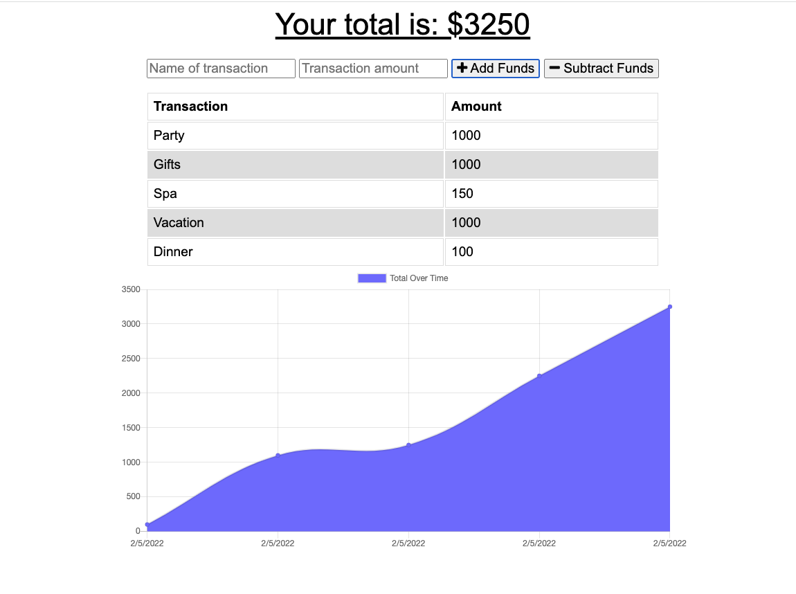

# 19-Budget-Tracker

## Description

This is a budget tracking app where the user can track withdrawals and deposits with or without a data/internet connection.

## Screenshot

## Table of Contents

* [Installation](#installation)
* [Usage](#usage)
* [Tests](#tests)
* [Questions](#questions)

## Installation 

On the command line type the following

* npm install

## Usage 

Type npm start from the command line to use the app

## Tests 

Currently there are no testing procedures for this application.

## Questions 

If you have any questions about the project, contact me at akhilasrinagula@gmail.com
